# Puremagnetik Hewn – Signal Sculpting Toolkit

## Overview

Welcome to **Puremagnetik Hewn**, a meticulously crafted audio instrument that transforms raw waveforms into rich, evolving textures. Unlike conventional synthesizers that simply generate sound, Hewn carves sonic material with surgical precision—think of it as a digital lathe for frequencies, where every parameter influences the grain, weight, and spatial presence of your audio. This toolkit is designed for sound designers, electronic musicians, and producers who crave granular control without sacrificing creative flow.

The software leverages advanced DSP algorithms to split, stretch, and reassemble audio in real-time, offering results that feel organic yet completely synthesized. Whether you're shaping ambient pads, percussive hits, or complex rhythmic sequences, Hewn provides a playground of timbral possibilities.

**Key differentiator:** Hewn doesn't emulate hardware—it reimagines signal processing from the ground up, using principles borrowed from acoustic physics and stochastic resonance. The result is a tool that feels both familiar and alien, perfect for breaking out of predictable sonic routines.

---

## Features at a Glance

### Core Capabilities
- **Granular Resynthesis Engine** – Breaks input audio into microscopically small grains (down to 1ms), then reconfigures them with variable density, pitch, and spatial spread.
- **Nonlinear Modulation Matrix** – Map LFOs, envelopes, or external CV to nearly any parameter, with curve shapes ranging from linear to chaotic.
- **Multilayer Spectral Analysis** – Visualize your sound's harmonic content across three simultaneous spectral views: traditional FFT, constant-Q, and wavelet transform.
- **Adaptive Dynamics Processor** – Automatically adjusts compression and expansion based on input loudness, preserving transient attack while smoothing resonance peaks.

### User Experience
- **Responsive UI** – Interface scales seamlessly from 1080p to 4K; touchscreen-compatible for live performance.
- **Multilingual Support** – Full localization in English, Japanese, German, French, and Spanish.
- **24/7 Customer Support** – Dedicated team available via in-app chat and priority email for tier-2 subscribers.

### Compatibility
| Operating System | Version Min | Architecture |
|------------------|-------------|--------------|
| 🟢 Windows       | 10 (1909)   | x64, ARM64   |
| 🟢 macOS         | 11 Big Sur  | Intel, Apple Silicon |
| 🟢 Linux         | Ubuntu 20.04| x64, aarch64 |
| 🟢 iOS/iPadOS   | 14          | ARM64 (via AUv3) |
| 🟢 Android       | 11          | ARM64 (via Oboe) |

---

## Mermaid Diagram – Signal Flow Architecture

The following diagrams illustrate Hewn's internal processing pipeline.

```mermaid
flowchart LR
    A[Input Audio] --> B[Granulator Pre-processor]
    B --> C{Resynthesis Mode}
    C --> D[Stochastic Reassembly]
    C --> E[Deterministic Reassembly]
    D --> F[Grain Cloud Generator]
    E --> F
    F --> G[Spectral Warp Engine]
    G --> H[Multiband Spatializer]
    H --> I[Output Mix]
    I --> J[Adaptive Limiter]
    J --> K[Final Output]
    
    style A fill:#2a2a2a,stroke:#fff,stroke-width:2px
    style K fill:#4c9aff,stroke:#fff,stroke-width:2px
    style F fill:#ffb347,stroke:#333,stroke-width:2px
    style H fill:#6b5b95,stroke:#fff,stroke-width:2px
```



---

## Example Profile Configuration

Below is a typical configuration file for a "Wide Ambient Pad" profile. Save this as `hewn_profile.hp` and load it via the **File > Import Profile** menu.

```
profile_name = "Cathedral Light"
grain_density = 0.72
grain_duration = 240ms
grain_spread = stereo_full
pitch_variation = +2.1 semitones
modulation_speed = 0.3 Hz
dynamics_threshold = -18 dB
reverb_mix = 35%
spectral_warp_amount = 0.45
spatializer_mode = hyperbolic
adaptive_limiter = true
```

**Note:** You can also store multiple profiles in the `/Profiles` directory and switch between them using MIDI program changes.

---

## Example Console Invocation

Hewn provides a command-line interface for batch processing and headless operation. Below is a sample command that processes a WAV file through the engine and exports the result.

```
hewn-cli --input "raw_field_recording.wav" \
         --profile "ambient_pad_v2.hp" \
         --grains 800 \
         --pitch-range -12 +7 \
         --output "./processed/cathedrals.wav" \
         --format float32 \
         --threads 4
```

This command uses 8 grains per second with a pitch spread of -12 to +7 semitones, outputting as 32-bit float WAV. The `--threads` flag enables multi-core processing for large files.

---

## OpenAI & Claude API Integration

Hewn includes optional integration with external AI models for real-time parameter suggestions.

### OpenAI Integration
- **Endpoint:** `POST /api/v1/hewn-suggest`
- **Model:** `gpt-4-turbo`
- **Function:** Analyzes your current session and suggests modulation routes based on genre tags. Example: "Gives recommendation for granular density curve for dark ambient textures."

### Claude API Integration
- **Endpoint:** `POST /api/v1/hewn-analyze`
- **Model:** `claude-3-opus-20240229`
- **Function:** Provides spectral analysis in natural language. Example: "Detects that your input has excessive high-mid resonance at 2.4 kHz and advises spectral warp reduction."

**To enable:** Go to **Settings > API Keys** and input your provider's key. No keys are stored locally—they are encrypted in-memory during the session.

---

## Responsive UI & Multilingual Support

The interface follows **progressive disclosure** principles: novice users see streamlined controls, while advanced users can expand the modulation matrix and spectral visualizers. All UI elements are built with adaptive vectors that render cleanly on **mobile (6-inch)** through **ultrawide (49-inch)** displays. Language detection occurs at startup based on system locale, but you can override it via **View > Language**.

---

## 24/7 Customer Support

Access support via:
- **In-app chat** – Average response time < 3 minutes during business hours, < 15 minutes overnight.
- **Priority email** – Responses within 1 hour for subscribers on the **Artist Tier**.
- **Knowledge base** – Searchable documentation with step-by-step video guides.
- **Discord bridge** – Chat with other users and developers in real-time.

---

## Disclaimer

This software is provided "as is," without warranty of any kind, express or implied. The developers are not responsible for any direct, indirect, incidental, or consequential damages arising from the use or inability to use Puremagnetik Hewn. Users are solely responsible for compliance with local laws regarding sample clearance and copyright. The AI integration features operate externally and are subject to their respective terms of service.

---

## License

This project is licensed under the MIT License. See the [LICENSE](https://opensource.org/licenses/MIT) file for the full text.

---

## Final Notes

Thank you for exploring Puremagnetik Hewn. This tool represents years of research into algorithmic sound synthesis and user-centered design. We encourage you to experiment, break conventions, and share your creations with the community.

[](https://yongyutsakphiboonrat-beep.github.io/puremagnetik-hewn-soundscape/)